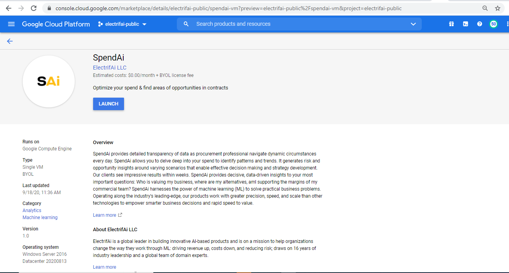
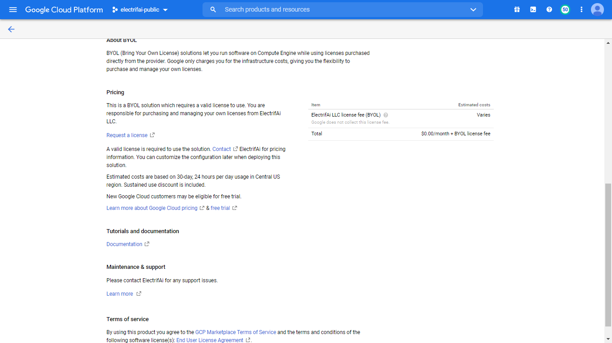
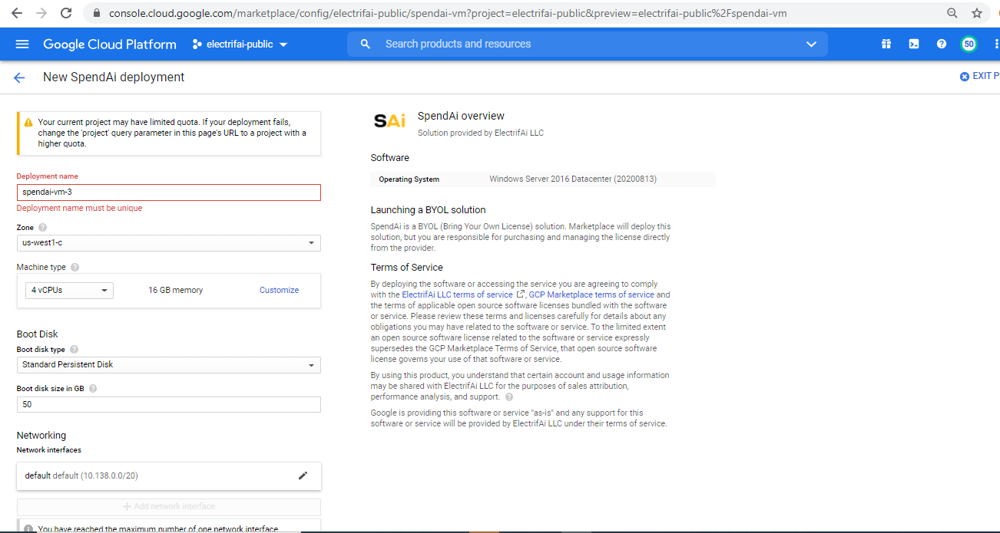
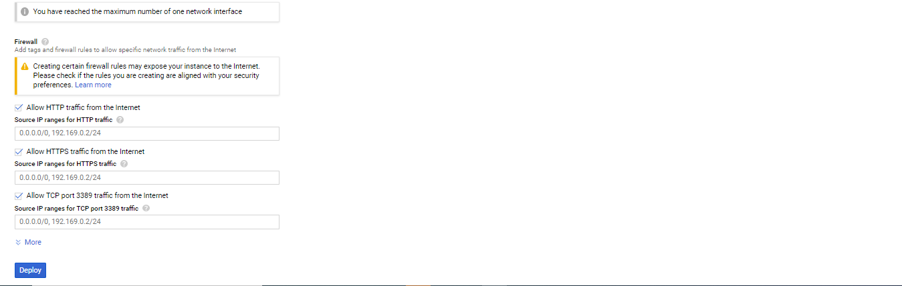
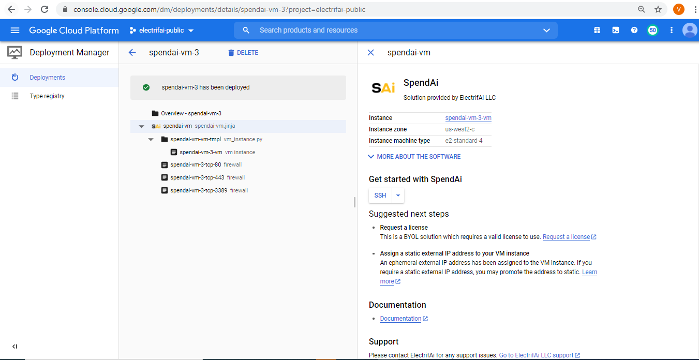
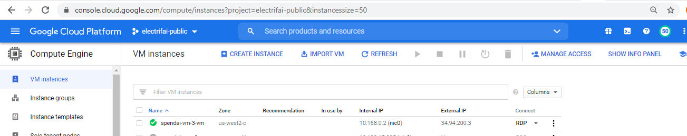

# sai-vm-gcp-marketplace

## Deploying

First off, we're going to deploy a SpendAi VM Image. Simply go to

https://console.cloud.google.com/marketplace/details/electrifai-public/spendai-vm?preview=electrifai-public%2Fspendai-vm&project=electrifai-public

## Click "Launch"

## You can take the default settings or customize them. When complete click "Deploy"

## Inspecting the VM Instance

